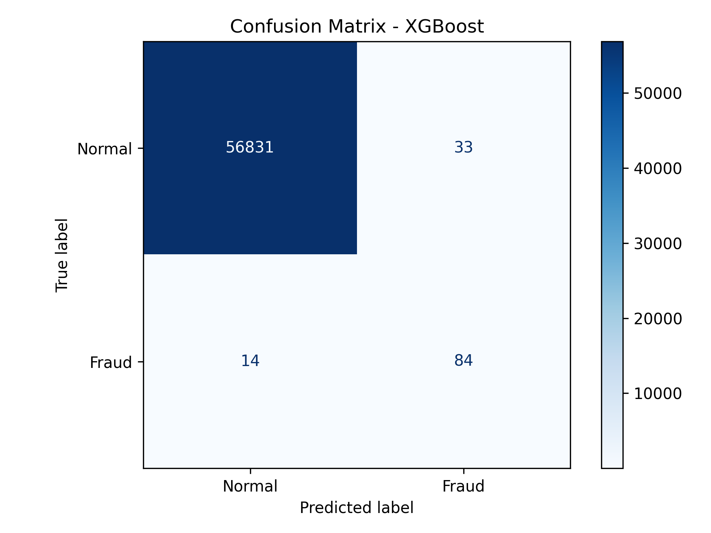

# Fraud Detection ML Pipeline

## Project Overview

This project is a modular machine learning pipeline for detecting potentially fraudulent credit card transactions. It demonstrates an end-to-end classification workflow, including data loading, validation, preprocessing, stratified train-test splitting, model training, evaluation, and saving results for reproducibility.

The project is designed as a GitHub portfolio piece for Data Science, Machine Learning, and AI internship applications.

## Business Problem

Credit card fraud detection is a risk analytics problem where fraudulent transactions are rare compared with normal transactions. Because the positive class is small, accuracy alone can be misleading: a model could appear accurate while still missing many fraud cases.

The goal is to identify suspicious transactions while balancing two business risks:

- **False negatives:** fraudulent transactions that the model misses.
- **False positives:** legitimate transactions that are incorrectly flagged as fraud.

In practice, fraud teams often care about recall, precision, F1-score, and PR-AUC because these metrics describe how well the model detects the rare fraud class and how many false alerts it creates.

## Tech Stack

- Python
- pandas
- NumPy
- scikit-learn
- Matplotlib
- joblib
- XGBoost

## Dataset

The pipeline expects the dataset at:

```text
data/creditcard.csv
```

The target column must be named `Class`:

- `0` = normal transaction
- `1` = fraudulent transaction

The dataset file is not committed to GitHub because it may be large and may have licensing restrictions. It is intentionally excluded from version control, so users should download the dataset separately and place it in the `data/` folder before running the pipeline.

Recommended dataset details to update after downloading the data:

| Item | Value |
|---|---|
| Dataset source | https://www.kaggle.com/datasets/mlg-ulb/creditcardfraud |
| Number of rows | 284807 |
| Number of features | 30 |
| Target column | `Class` |
| Fraud class | `1` |
| Fraud rate | 0.1727% |

## Pipeline Workflow

```text
Raw CSV Data
     ↓
Validate Target Column
     ↓
Split Features and Target
     ↓
Stratified Train/Test Split
     ↓
Preprocessing with scikit-learn Pipelines
     ↓
Tune Hyperparameters + Select Best Model (Stratified K-Fold CV, PR-AUC)
     ↓
Train Best Models on Full Training Set
     ↓
Evaluate Once on Held-Out Test Set (Fraud-Relevant Metrics)
     ↓
Tune Decision Threshold (from Training CV)
     ↓
Save CV Results, Metrics, Threshold Comparison, Plots, and Best Model
```

## Model Training Approach

The pipeline trains three models:

- Logistic Regression
- Random Forest
- XGBoost Classifier

XGBoost is included in `requirements.txt`. If for some reason it is not installed,
the pipeline degrades gracefully and trains only Logistic Regression and Random Forest.

Class imbalance is handled using:

- `class_weight="balanced"` for Logistic Regression and Random Forest
- `scale_pos_weight` for XGBoost

Preprocessing is included inside model pipelines to keep training and evaluation consistent.

## Evaluation Metrics

Because fraud detection is highly imbalanced, accuracy alone is not a reliable metric. This project evaluates models using metrics that better reflect rare-class detection:

| Metric | Why It Matters |
|---|---|
| Confusion matrix | Shows true negatives, false positives, false negatives, and true positives |
| Precision | Of the transactions flagged as fraud, how many were actually fraud |
| Recall | Of all real fraud cases, how many the model detected |
| F1-score | Balances precision and recall |
| ROC-AUC | Measures ranking quality across classification thresholds |
| PR-AUC | Especially useful when the positive class is rare |

The best model is selected using PR-AUC because it is better suited for imbalanced classification than accuracy.

## Hyperparameter Tuning and Model Selection

Each model's hyperparameters are tuned with **RandomizedSearchCV** using **5-fold
stratified cross-validation on the training set only**, scored by PR-AUC. The best
configuration per model is compared, and the overall best model is selected by mean
cross-validated PR-AUC. The test set is never used for tuning or selection; it is
held out and scored a single time for the final results below. This avoids leaking
the test set into the selection decision and gives a variance estimate (standard
deviation across folds) for each model.

`RandomizedSearchCV` is preferred over an exhaustive grid search because it samples
the parameter space, covering more ground for a fixed compute budget.

Best cross-validated results per model (training set):

| Model | Mean PR-AUC | Std PR-AUC | Best Hyperparameters |
|---|---:|---:|---|
| XGBoost | 0.8481 | 0.0234 | n_estimators=400, max_depth=4, learning_rate=0.05, subsample=0.7, colsample_bytree=1.0 |
| Random Forest | 0.8451 | 0.0186 | n_estimators=200, max_depth=20, min_samples_split=2, min_samples_leaf=1, max_features=sqrt |
| Logistic Regression | 0.7568 | 0.0518 | C=0.1 |

## Results

Final results on the held-out test set (default 0.5 threshold):

| Model | Precision | Recall | F1-score | ROC-AUC | PR-AUC |
|---|---:|---:|---:|---:|---:|
| Logistic Regression | 0.0611 | 0.9184 | 0.1145 | 0.9720 | 0.7107 |
| Random Forest | 0.9487 | 0.7551 | 0.8409 | 0.9514 | 0.8571 |
| XGBoost | 0.7179 | 0.8571 | 0.7814 | 0.9821 | 0.8668 |

PR-AUC is used as the selection metric because it is better suited for imbalanced
classification than accuracy. XGBoost wins on cross-validated PR-AUC (the selection
metric) and also has the highest test-set PR-AUC and ROC-AUC, with Random Forest a
close second.

### Key Takeaways

- Logistic Regression achieved the highest recall at the default threshold but with
  very low precision, meaning it flags far too many legitimate transactions as fraud.
- XGBoost has the best cross-validated and test-set PR-AUC, so it is selected as the
  best model; Random Forest is a close second.
- At the default 0.5 threshold XGBoost shows lower precision and F1 than Random Forest.
  This is because `scale_pos_weight` shifts its predicted probabilities, so 0.5 is a
  poor cutoff. Tuning the decision threshold (below) fixes this and makes XGBoost the
  strongest model overall.

### Confusion Matrix

The confusion matrix below is generated for the best model selected by PR-AUC:



## Threshold Tuning

The metrics above use the default 0.5 probability cutoff, which is rarely the right
operating point for imbalanced fraud detection. For the best model, a decision
threshold is selected from **cross-validated predictions on the training set** (the
test set is not used to pick the threshold) and then applied once to the test set.

Test-set metrics for the best model (XGBoost) at different thresholds:

| Strategy | Threshold | Precision | Recall | F1-score |
|---|---:|---:|---:|---:|
| Default (0.5) | 0.50 | 0.7179 | 0.8571 | 0.7814 |
| Max F1 | 0.92 | 0.8804 | 0.8265 | 0.8526 |
| Recall >= 0.90 | 0.01 | 0.0543 | 0.9286 | 0.1025 |

Key takeaways:

- XGBoost is trained with `scale_pos_weight` to counter the class imbalance, which
  inflates its predicted fraud probabilities. As a result the default 0.5 cutoff is a
  poor operating point (F1 0.78) and the max-F1 threshold is pushed up to about 0.92.
- At the **max-F1 threshold (0.92)** XGBoost reaches precision 0.88 and recall 0.83 for
  an F1 of 0.85 — a large jump over its default-0.5 F1 (0.78), and better than Random
  Forest. This is a concrete example of why the decision threshold must be tuned,
  especially for models that internally reweight the classes.
- Forcing **90% recall** requires such a low threshold (0.01) that precision collapses
  to about 0.05, which illustrates the precision-recall tradeoff and why the threshold
  should be chosen from the business cost of false negatives vs false positives.

## Generated Outputs

After running the pipeline, the following files are generated or updated:

```text
results/tuning_results.csv         # cross-validated tuning results per model
results/metrics.csv                # test-set model comparison metrics
results/threshold_metrics.csv      # test-set metrics at different thresholds
results/confusion_matrix.png       # confusion matrix for the best model
results/precision_recall_curve.png # precision-recall curve for the best model
models/best_model.pkl              # saved best model artifact
```

The trained model artifact is not committed to GitHub because model files are generated outputs and can become large.

## How to Run

Create a virtual environment:

```bash
python -m venv .venv
```

Activate the environment.

On macOS/Linux:

```bash
source .venv/bin/activate
```

On Windows:

```bash
.venv\Scripts\activate
```

Install dependencies (includes XGBoost):

```bash
pip install -r requirements.txt
```

Run the full pipeline:

```bash
python main.py
```

## Folder Structure

```text
fraud-detection-ml-pipeline/
|-- data/
|   |-- README.md
|   `-- creditcard.csv          # not committed; user-provided dataset
|-- models/
|   |-- README.md
|   `-- best_model.pkl          # generated after running the pipeline
|-- results/
|   |-- tuning_results.csv      # cross-validated tuning results
|   |-- metrics.csv             # saved model metrics
|   |-- threshold_metrics.csv   # metrics at different thresholds
|   |-- confusion_matrix.png    # saved confusion matrix image
|   `-- precision_recall_curve.png # saved precision-recall curve
|-- evaluate_model.py           # evaluation metrics and plotting
|-- main.py                     # pipeline entry point
|-- train_model.py              # data loading, splitting, and model training
|-- requirements.txt
`-- README.md
```

## Skills Demonstrated

- Python scripting for end-to-end ML workflows
- Data loading and validation with pandas
- Train-test splitting with stratification
- Preprocessing with scikit-learn pipelines
- Handling class imbalance with class weights
- Training Logistic Regression, Random Forest, and XGBoost models
- Fraud-focused model evaluation with precision, recall, F1-score, ROC-AUC, PR-AUC, and confusion matrix
- Leak-free model selection with stratified k-fold cross-validation
- Hyperparameter tuning with RandomizedSearchCV
- Decision-threshold tuning from the precision-recall curve
- Saving model artifacts with joblib
- Organizing a machine learning repository for GitHub portfolio presentation

## Future Improvements

- Compare additional imbalance techniques such as SMOTE or undersampling
- Track experiments with MLflow or Weights & Biases
- Add unit tests for data loading, model training, and evaluation
- Package the trained model behind a simple API or dashboard
